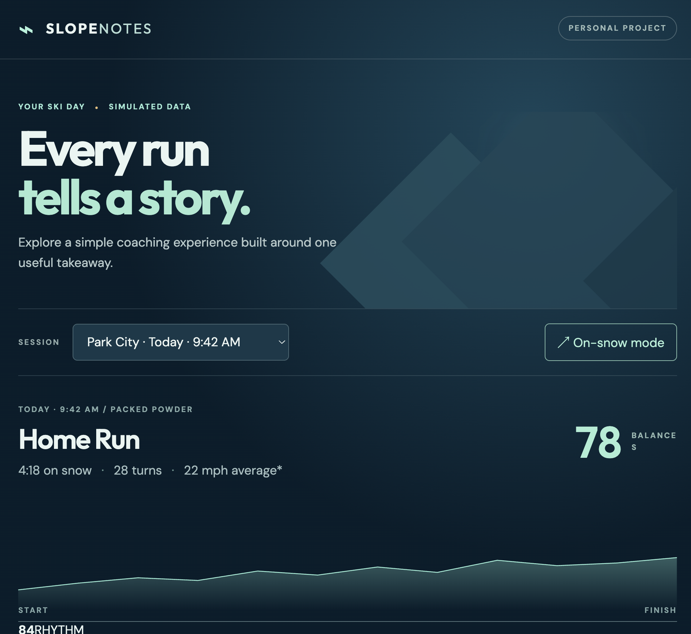

# Slope Notes — independent ski coaching concept

A small, mobile-friendly React prototype exploring a single coaching cue after a ski run. This is a personal portfolio project, showcasing current abilities while trying new ones. It does not use real data, sensors, branding, or APIs. All session data and scores are fictional.

## Run locally

Requires Node.js 18+ and npm.

```bash
npm install
npm run dev
```

Open the URL printed by Vite. For a production build, run `npm run build` and `npm run preview`.

## Explore

- Switch between two simulated sessions to see different coaching priorities.
- Select **Key moments** for a short timeline and **How it works** for the prototype's limits.
- Try **On-snow mode** at a narrow phone width. The primary cue becomes larger and simpler.
- Select **Listen to cue** to hear browser text-to-speech, where supported.

## Product and engineering decisions

| Decision | Why | Next validation |
| --- | --- | --- |
| One cue per run | Avoid overwhelming a skier | Ask skiers whether they remember and use it next run |
| Transparent rules | Make the prototype inspectable | Compare coaching relevance with expert review |
| Post-run feedback | Avoid distracting a skier mid-turn | Test safe moments and audio timing on snow |
| Large on-snow controls | Support quick interaction outdoors | Test gloves, glare, cold, and wet screens |
| Local static data | Keep scope small and claims honest | Define consent, offline caching, sync, and signal contracts before using real data |

## Rule logic

`src/coaching.js` chooses a cue in this order: left/right turn gap of at least 10 points; balance score under 75; otherwise rhythm. This is a demonstration rule, **not validated biomechanical advice**. `src/data.js` contains hand-authored examples. The chart is illustrative.

## Possible architecture if extended

A mobile client could cache sessions locally and enqueue uploads; a backend could normalize sensor events and serve confidence-tagged summaries; a separate coaching service could generate and version cues. The client should show a cue only when validated data and timing allow it. This prototype intentionally implements none of those production components.

## Current Bugs (because a project is never complete)

I adjusted some CSS that broke some React components. I need to debug to find where that occured.

## Screenshot


